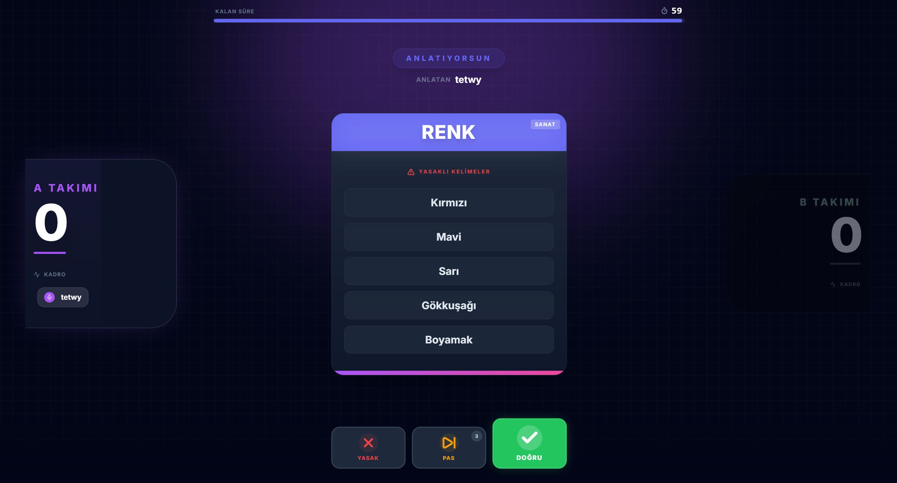

# VETO - Modern Kelime Anlatma Oyunu 🎮

**VETO**, arkadaşlarınızla gerçek zamanlı olarak oynayabileceğiniz, modern, şık ve hızlı bir kelime anlatma oyunudur. Yasaklı kelimeleri kullanmadan takımınıza hedef kelimeyi anlatın, puanları toplayın ve zaferi kapın!

Klasik "Tabu" oyununun dijital dünyaya, modern bir tasarımla uyarlanmış halidir. İster yan yana, ister uzaktan arkadaşlarınızla keyifle oynayabilirsiniz.

## ✨ Öne Çıkan Özellikler

* **⚡ Gerçek Zamanlı Çok Oyunculu:** Anlık veri akışı sayesinde, bir oyuncu anlatırken diğerleri anında takip edebilir.
* **🎨 Modern & Şık Tasarım:** Neon ışıklar, Glassmorphism (buzlu cam) efektleri ve akıcı animasyonlarla zenginleştirilmiş, göz alıcı bir arayüz.
* **📱 Her Cihazda Oyna:** Telefon, tablet veya bilgisayar fark etmeksizin, tamamen responsive yapısı sayesinde her yerden erişilebilir.
* **🛠️ Kuralları Sen Belirle:** Tur süresi, hedef skor ve pas haklarını oyunun gidişatına göre özelleştir.
* **🏆 Canlı Rekabet:** Anlık güncellenen skor tablosu ve maç sonu detaylı kazanan ekranı ile rekabeti hisset.
* **🔐 Kolay Erişim:** Karışık kayıt işlemleri yok; bir oda oluşturun, kodu arkadaşlarınızla paylaşın ve hemen oynamaya başlayın.

## 🎯 Nasıl Oynanır?

1.  **Oda Kur:** Bir oyuncu odayı oluşturur ve oyun ayarlarını (süre, pas hakkı vb.) belirler.
2.  **Davet Et:** Oluşturulan 6 haneli özel oda kodunu arkadaşlarınla paylaş.
3.  **Takımları Seç:** Oyuncular A veya B takımına katılır.
4.  **Anlatmaya Başla:** Sırası gelen "Anlatıcı", karttaki **yasaklı kelimeleri kullanmadan** en üstteki hedef kelimeyi takımına anlatmaya çalışır.
5.  **Puanla:**
    * Takım doğru bilirse ✅ **DOĞRU** butonuna bas (Puan kazan).
    * Yasaklı kelime kullanılırsa ❌ **YASAK** butonuna bas (Puan kaybet).
    * Zorlanırsan ⏭️ **PAS** butonunu kullan (Hakkın varsa).
6.  **Kazan:** Hedef skora ilk ulaşan takım oyunu kazanır!

---

## 📄 Lisans

Bu proje [MIT Lisansı](LICENSE) ile lisanslanmıştır.

---
*Developed with ❤️ for fun.*